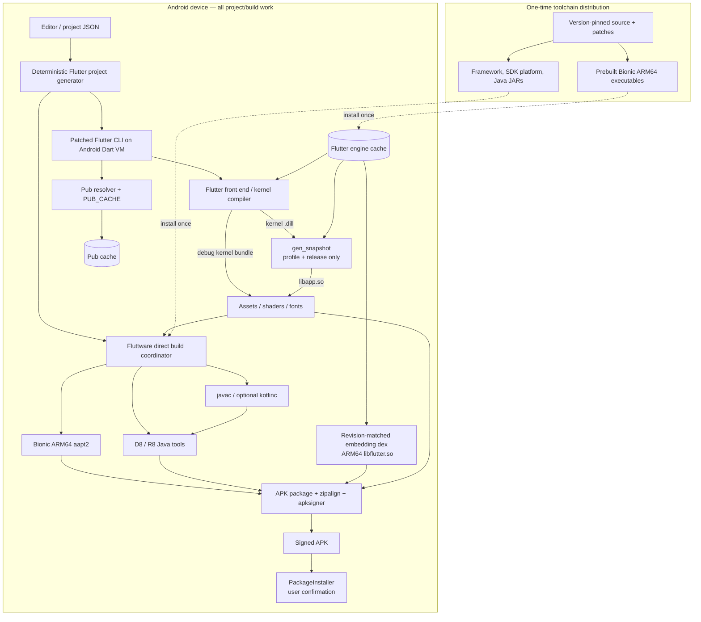

# Feasibility report: complete Flutter APK builds on Android

Research cut-off: **2026-08-03**. Control SDK: **Flutter 3.44.8 / Dart
3.12.2**. Target considered: unrooted ARM64 Android, with no server or desktop
participating in project generation, dependency resolution, compilation,
packaging, signing, or installation.

## 1. Conclusion

It is technically possible to build Flutter Android APKs entirely on an Android
device. It is **not** technically possible to do so by unpacking the ordinary
Flutter Linux SDK and ordinary Google Android SDK build-tools and expecting them
to run unchanged.

The complete path requires:

- a Dart SDK built for Android/Bionic rather than Linux/glibc;
- small Flutter-tool changes so Android ABIs are recognized as host platforms;
- Bionic/ARM64 builds of Flutter host tools, especially `gen_snapshot` for
  profile and release;
- ARM64/Bionic Android build tools, especially `aapt2` and `zipalign`;
- an on-device JDK and Gradle;
- `android.aapt2FromMavenOverride` so AGP does not select its Linux x86-64
  Maven binary;
- a packaging strategy compatible with Android's executable-code policy.

The strongest independent implementation found is
[ImL1s/termux-flutter-wsl](https://github.com/ImL1s/termux-flutter-wsl). Its
published July 4, 2026 ARM64 device smoke test reports Flutter 3.44.2, Dart
3.12.1, `flutter doctor`, project creation, and a release ARM64 APK on Android
16. That is credible implementation evidence, but it is not treated as a test
performed in this workspace.

The remaining gap is productization, not proof of computational possibility.
A Termux installation can own a writable executable tree because of its legacy
and packaging choices. A new Android IDE targeting current APIs must instead
ship executable code in its APK/native-library area or obtain platform changes;
it cannot download a compiler to `files/`, mark it executable, and run it.

### Evidence labels

| Label | Meaning |
|---|---|
| Control-tested | Executed in this Linux x64 workspace; raw log is included. |
| Device-tested | Executed by this repository's standalone app on the named physical Android device; captured evidence is included. |
| Source-verified | Confirmed in current official source or documentation. |
| Independent device report | A named project publishes the device, version, command, and result; not reproduced here. |
| Device-pending | The stage is instrumented or planned but has not yet been executed by this repository on Android. |
| Estimate | Engineering range, explicitly not a measurement. |

## 2. Architecture

The following design keeps every per-project operation on the phone. Producing
and publishing a versioned toolchain package is analogous to Google producing a
Flutter SDK archive: it is setup, not a companion build service.



### Product deployment choices

| Model | Advantages | Limitations | Recommendation |
|---|---|---|---|
| Native Termux/Bionic | Fastest, existing packages, demonstrated | Termux-specific paths; current executable packaging is not a template for a Play-distributed modern app | Research and near-term POC |
| Debian/glibc under `proot` | Runs more Linux ARM64 binaries; no root | syscall/path translation overhead; still needs Android ARM64 build tools; more disk/RAM | Compatibility fallback |
| Dedicated Android app | Sketchware-like UX and lifecycle control | Every executable must be APK-packaged; large ABI-specific APK/splits; updates are app updates | Long-term product |
| Root/chroot/VM | Closest to desktop Linux | Requires root or large virtualization layer; outside normal consumer-app scope | Not the default |

## 3. End-to-end build map

The requested “Project JSON” layer is outside Flutter and should be a
deterministic generator. It must emit at least `pubspec.yaml`, `lib/main.dart`,
assets, Android manifest/resources, and any plugin-specific configuration.
Gradle settings are optional compatibility output, not an input to Fluttware's
direct debug pipeline.

| Stage | Input → output | Actual tools/processes |
|---|---|---|
| Project model | JSON → Flutter source tree | IDE app or a Dart/Kotlin generator; no compiler required |
| Project bootstrap | template options → Android/Flutter scaffolding | `flutter create`, Dart VM, Flutter templates, Git metadata checks |
| Dependency solve | `pubspec.yaml` → lockfile/package config | `flutter pub get` → `dart pub`; HTTPS/TLS; pub cache |
| Flutter compile | Dart sources → kernel `.dill` | Dart VM, Flutter front end snapshot, patched Flutter SDK, package config |
| Flutter AOT | kernel `.dill` → `libapp.so` | `gen_snapshot`; profile/release only |
| Flutter bundle | code + assets → `flutter_assets` | Flutter build system, asset transformer, `impellerc` when shaders require it, `font-subset` when icon tree shaking is enabled |
| Android configuration | Flutter outputs → packaging inputs | Standard route: Flutter Gradle plugin/Gradle/AGP. Fluttware route: a deterministic direct-packaging coordinator |
| JVM compile | Java/Kotlin → `.class` | `javac`, Kotlin compiler/daemon when Kotlin exists |
| Resources | XML/images/manifest → compiled resource table | `aapt2 compile`, `aapt2 link` |
| Dex | `.class`/JAR → `classes.dex` | D8; R8 when shrinking/obfuscating |
| Native merge | engine/plugin `.so` + `libapp.so` → APK entries | AGP tasks, or direct ZIP assembly; native stripping may use NDK LLVM tools |
| Package | resources + dex + assets + native libs → unsigned/aligned APK | AGP packaging, or direct ZIP/JAR assembly plus `zipalign` when required |
| Sign | aligned APK → signed APK | `keytool` for key generation; `apksigner` for v1/v2/v3/v4 signatures |
| Install | signed APK → installed package | Android `PackageInstaller` or package-installer intent; `adb install` only when an ADB route exists |

Ordering is important: `zipalign` precedes `apksigner`; changing the APK after
signing invalidates its signature. Android's official
[apksigner documentation](https://developer.android.com/tools/apksigner)
states the same constraint.

## 4. Experimental results and logs

### What was actually run here

Two environments were used. Ubuntu 26.04 x86-64 supplied the control run and
built the proof APK. A physical Samsung SM-A356E, ARM64, Android 16/API 36 then
installed and executed the standalone proof app. The app's build operations
used only its APK assets, private files, network connection, and child
processes; no desktop or server participated in those device-side operations.

The Linux control logs remain in [`evidence/host`](../evidence/host):

| Test | Result | Evidence / interpretation |
|---|---|---|
| Dart version | Pass: 3.12.2 `linux_x64` | [`02_dart_version.log`](../evidence/host/02_dart_version.log) |
| Dart front end | Pass: `dart compile kernel` | [`03_dart_compile_kernel.log`](../evidence/host/03_dart_compile_kernel.log) |
| Dart AOT executable | Pass; generated and executed | [`04_dart_compile_exe.log`](../evidence/host/04_dart_compile_exe.log), [`05_dart_compiled_exe.log`](../evidence/host/05_dart_compiled_exe.log) |
| Flutter CLI | Pass: Flutter 3.44.8 | [`10_flutter_version.log`](../evidence/host/10_flutter_version.log) |
| Flutter doctor | CLI completes; Android SDK incomplete; ADB and network blocked by sandbox | [`11_flutter_doctor.log`](../evidence/host/11_flutter_doctor.log) |
| Flutter create | Pass with `--no-pub`; 35 files written | [`12_flutter_create.log`](../evidence/host/12_flutter_create.log) |
| Pub download | Fails: the execution sandbox has no network | [`13_flutter_pub_get.log`](../evidence/host/13_flutter_pub_get.log) |
| Pub offline reuse | Correctly fails because the isolated cache was never populated | [`14_flutter_pub_get_offline.log`](../evidence/host/14_flutter_pub_get_offline.log) |
| APK build | Reaches Gradle; fails because this sandbox redirects Gradle to a read-only home and has no downloadable distribution | [`20_flutter_build_apk.log`](../evidence/host/20_flutter_build_apk.log) |

These control failures are preserved rather than hidden. They are not evidence
that those operations fail on Android.

The physical-device milestones are:

| Test | Result | Evidence / interpretation |
|---|---|---|
| Android/Bionic native child | Pass: ARM64 PIE, controlled environment, both output streams, file write | [`00_sketchware_asset_exec.log`](../evidence/device/00_sketchware_asset_exec.log) |
| Dart VM | Pass: Dart 3.12.2 reports `android_arm64`; source and child process run | [`01_dart_sdk.log`](../evidence/device/01_dart_sdk.log) |
| Dart front end | Pass: `dart compile kernel`, generated `.dill` executes | [`01_dart_sdk.log`](../evidence/device/01_dart_sdk.log) |
| Flutter CLI | Pass: patched Flutter 3.44.8 `flutter --version` | [`02_flutter_cli.log`](../evidence/device/02_flutter_cli.log) |
| Flutter project creation | Pass: Android project, 34 files | [`02_flutter_cli.log`](../evidence/device/02_flutter_cli.log) |
| Pub online then offline | Pass: 26 dependencies downloaded, private cache reused offline | [`02_flutter_cli.log`](../evidence/device/02_flutter_cli.log) |
| OpenJDK / javac | Pass: Android/Bionic ARM64 OpenJDK 21.0.12 | [`03_jdk_gradle.log`](../evidence/device/03_jdk_gradle.log) |
| Gradle wrapper online then offline | Pass: Gradle 9.1.0 downloaded, unpacked, executed, and cache-reused | [`03_jdk_gradle.log`](../evidence/device/03_jdk_gradle.log) |
| Direct native APK build/sign/install/run | Pass: AAPT2, javac, D8, ZIP, keytool, apksigner, PackageInstaller; 6.6 s build | [`04_direct_android_apk.log`](../evidence/device/04_direct_android_apk.log) |
| Flutter project Gradle configuration | Rejected as the product path after AGP/NDK host assumptions; retained only as research | Device-tested failure |
| Direct Flutter debug APK | Pass: ARM64 frontend server → kernel, AAPT2/package/sign, engine launch and Flutter first frame; 27.6 s pipeline | [`05_direct_flutter_debug_apk.log`](../evidence/device/05_direct_flutter_debug_apk.log) |

### What stock binary inspection proves

The installed stock Flutter SDK's Dart executable and all selected
`gen_snapshot` files are x86-64 ELF files whose interpreter is
`/lib64/ld-linux-x86-64.so.2`. The raw `file(1)` output is in
[`01_stock_binaries.log`](../evidence/host/01_stock_binaries.log). An ARM64
Android device has a different instruction set and Android dynamic linker/Bionic
ABI, so these exact files cannot execute there. Linux ARM64 binaries solve the
instruction-set mismatch but still target glibc/Linux, not Android/Bionic.

### Physical Android execution status

The v0.17 standalone app was tested on the physical device above. Its Flutter
tool is a version-pinned kernel build with the repository's three-part Android
host patch, not the stock desktop AOT snapshot. Current status is:

| Command | Result | Evidence class |
|---|---|---|
| Native executable and process plumbing | Pass | Device-tested |
| `dart --version`, source, child process, `dart compile kernel` | Pass | Device-tested |
| `flutter --version` | Pass, Flutter 3.44.8 | Device-tested |
| `flutter create --platforms=android --no-pub --empty` | Pass | Device-tested |
| `flutter pub get`, then `flutter pub get --offline` | Pass | Device-tested |
| `java --version` / `javac -version` | Pass, OpenJDK 21.0.12 | Device-tested |
| Gradle wrapper `--version`, then `--offline --version` | Pass, Gradle 9.1.0 | Device-tested |
| Direct AAPT2 → javac → D8 → ZIP → apksigner | Pass; signed APK in 6.6 s | Device-tested |
| `PackageInstaller` install and generated app launch | Pass; `dev.fluttware.generated/.MainActivity` resumed | Device-tested |
| `flutter doctor -v` | Not run by v0.5 | Device-pending |
| Direct Flutter engine/kernel APK | Pass: 40.6 MB APK, v2/v3 signed, installed, cold-launched, `Hello World!` rendered | Device-tested |
| Independent `flutter build apk --release --target-platform android-arm64 --no-tree-shake-icons` | Reported pass on Samsung SM-X716B / Android 16 | Independent device report |

The independent port is a fork with patches and Bionic-native artifacts; it
does not prove that the stock SDK works.

## 5. Flutter SDK analysis

### Can the Flutter CLI run on Android?

Yes, after adaptation. Fluttware v0.4 proves that the Dart implementation of
Flutter Tools can run directly inside a standalone Android app. The ordinary
Flutter command is a Bash bootstrap that invokes a Dart snapshot. Current
[`bin/internal/shared.sh`](https://raw.githubusercontent.com/flutter/flutter/master/bin/internal/shared.sh)
requires Bash/POSIX utilities, Git, a writable SDK cache, the bundled Dart VM,
and the Flutter tool snapshot. All of those concepts work on Android.

The experiment found these concrete stock assumptions:

1. The cached stock `flutter_tools.snapshot` is AOT-compiled for the SDK host.
   The tested Linux x64 snapshot was rejected by the Android ARM64 Dart VM due
   to its incompatible VM configuration. Recompiling it as a portable kernel
   `.dill` fixed that startup failure.
2. Flutter requires Git to be discoverable and normally queries it for version
   information. The APK has immutable, hash-checked version metadata instead.
3. Flutter's normal cache updater expects a supported desktop host artifact
   set. During unpatched `flutter create`, it reached the MaterialFonts update
   and failed. The Android patch disables that updater so Fluttware can manage
   its explicitly bundled artifacts.
4. Official Flutter installation documentation offers Windows, macOS, Linux,
   and ChromeOS host workflows, not Android. See the
   [official manual installation page](https://docs.flutter.dev/install/manual)
   and [SDK archive](https://docs.flutter.dev/install/archive).
5. Later engine-artifact selection switches on Dart FFI ABIs for macOS, Linux, and
   Windows. Current `OperatingSystemUtils.hostPlatform` throws for other ABIs.
   Dart explicitly distinguishes `Abi.androidArm64` from `Abi.linuxArm64` in
   its [ABI API](https://api.dart.dev/dart-ffi/Abi-class.html). Therefore an
   Android-built Dart VM exposes a host ABI for which the complete build path
   still needs an explicit artifact strategy.

Required Flutter-tool changes are small but version-sensitive:

- map Android ARM64 to a new Android host platform or a deliberately named
  Bionic artifact directory;
- select Android/Bionic cache archives instead of Linux archives;
- remove desktop-only doctor checks that are meaningless on Android;
- use Termux/app-specific executable and SDK paths;
- keep all caches writable;
- override AGP's `aapt2` choice;
- either provide Bionic `font-subset`/`impellerc` or disable only their
  dependent optimizations.

`flutter create` is mostly template expansion and Dart file I/O; it does not
need the engine or Android SDK if pub is suppressed. `flutter pub get` is Dart
pub plus networking. Both now pass in the standalone app, including a second
offline resolution against the same private Pub cache. The exact patch and
failure progression are in
[`02_flutter_cli.log`](../evidence/device/02_flutter_cli.log).

## 6. Dart SDK analysis

### Native Dart on Android

Dart can run on Android. This is stronger than an inference: the current Termux
package definition builds Dart **3.12.2** from source with:

```text
./tools/build.py --arch arm64 --mode release --os android create_sdk
```

See Termux's current
[`packages/dart/build.sh`](https://raw.githubusercontent.com/termux/termux-packages/master/packages/dart/build.sh).
This produces Android/Bionic `dart` and SDK snapshots and installs wrappers in
the Termux prefix.

### Front end and `dart compile`

| Capability | Finding |
|---|---|
| Parse/analyze/run Dart | Device-tested with Dart 3.12.2 `android_arm64`; source and child process both execute |
| Pub client | Device-tested through Flutter: online dependency download and offline private-cache reuse both pass |
| Kernel front end | Device-tested: the Android Dart VM executes the SDK kernel compiler snapshot |
| `dart compile kernel` | Device-tested: generated an 8,225,792-byte `.dill` and executed it |
| `dart compile exe` | Requires the SDK's AOT runtime/`gen_snapshot` support built for the host and target; Android SDK build includes platform-specific binaries; exact probe pending |
| Linux executable from `dart compile --target-os=linux` | Not useful as an Android/Bionic executable; Dart's documented cross-target is Linux, not Android |

Dart's public downloads support Linux ARM64, but the
[Dart system-requirements table](https://dart.dev/get-dart) lists Linux,
Windows, and macOS as development hosts, not Android. The Termux build closes
that distribution gap; it is not the same binary as the Linux archive.

Platform-specific Dart pieces include `dart`, `dartaotruntime`,
`gen_snapshot`, and any AOT-compiled SDK/tool snapshots. Pure `.dart`, `.dill`,
package metadata, and most SDK library sources are portable data.

## 7. Flutter engine and build modes

Flutter pins an engine revision and populates `bin/cache/artifacts/engine`.
Artifact paths combine target platform, build mode, and host platform. Current
Flutter source resolves Android `gen_snapshot` below, conceptually:

```text
engine/android-arm64-{profile|release}/{host-platform}/gen_snapshot
```

The relevant current implementation is
[`packages/flutter_tools/lib/src/artifacts.dart`](https://raw.githubusercontent.com/flutter/flutter/master/packages/flutter_tools/lib/src/artifacts.dart).
It explicitly asserts that `gen_snapshot` is unavailable for debug and chooses
the current host platform for non-debug Android artifacts.

Engine artifacts can be bundled or downloaded. They must exactly match the
Flutter framework/engine revision; mixing `gen_snapshot`, patched platform
kernels, and `libflutter.so` from different revisions can produce compile or
runtime failures. A product should publish a signed manifest with version,
engine content hash, ABI, byte size, and SHA-256 for every artifact.

### Required artifacts by mode

| Artifact | Debug | Profile | Release | Android-host requirement |
|---|---:|---:|---:|---|
| Android `flutter.jar` / embedding | Yes | Yes | Yes | Data/JAR containing target ARM64 `libflutter.so`; not executed by builder |
| `libflutter.so` target engine | Yes, JIT-capable | Yes | Yes, product runtime | Target artifact packaged into APK |
| Flutter patched SDK / `platform_strong.dill` | Yes | Yes | Product variant | Portable data but revision-locked |
| Front-end server snapshot | Yes | Yes | Yes | Snapshot must run on Android Dart runtime |
| `gen_snapshot` | **No** | **Yes** | **Yes** | Bionic ARM64 host executable that emits Android ARM64 AOT ELF |
| `libapp.so` | No; kernel/JIT bundle instead | Generated | Generated | Output, not prebuilt |
| ICU data / snapshot data | As required by host tooling | As required | As required | Data; revision-locked |
| `impellerc` | When build-time shaders require it | Same | Same | Bionic host binary or feature-specific workaround |
| `font-subset` | Usually not needed | When icon tree shaking enabled | When icon tree shaking enabled | Bionic host binary; `--no-tree-shake-icons` avoids it at size cost |

Flutter's official [build-mode documentation](https://docs.flutter.dev/testing/build-modes)
confirms debug is the hot-reload/development mode and profile/release are
optimized modes. The important implementation detail here is that Android
debug avoids `gen_snapshot`; it does **not** avoid the Dart front end, Gradle,
resource compiler, dexer, engine artifacts, or signing. Debug is therefore the
easiest first milestone, not a toolchain-free build.

## 8. Android build-tool compatibility

Google's command-line SDK is a mixture of Java and native host executables.
Calling the entire directory “Linux tools” hides the decisive distinction.

| Component | Needed for a basic Flutter APK? | Android status | Adaptation |
|---|---:|---|---|
| OpenJDK 17/21 (`java`, `javac`, `keytool`, `jar`) | Yes | Device-tested here with Android/Bionic OpenJDK 21.0.12 | Bundle compatibility libraries; private `JAVA_HOME`/`LD_LIBRARY_PATH` |
| Gradle launcher/wrapper | No for Fluttware's direct route | Device-tested here with Gradle 9.1.0, but removed from the generated-APK critical path | Keep only for compatibility experiments |
| Android Gradle Plugin | No for Fluttware's direct route | Standard Flutter builds require it; direct packaging replaces its orchestration | Implement manifest/resource/dex/native merge explicitly |
| Android SDK platform (`android.jar`, resources) | Yes | Portable data | None beyond path/version |
| SDK command-line tools / `sdkmanager` | Setup only | Mostly Java and can run, but repository selects unsupported native payloads | Custom manifest/repository or curated installer |
| `aapt2` | Yes | Stock Linux download is x86-64/glibc | Bionic ARM64 build; AGP override property |
| D8 | Yes | Java entry point in build-tools JARs | Working Java wrapper/path |
| R8 | Only for minify/shrink | Java; works but memory-heavy | Disable for first POC; tune heap for production |
| `zipalign` | Release/signing pipeline | Stock native binary does not run | Bionic ARM64 build |
| `apksigner` | Yes | Java tool; works | Correct wrapper/classpath |
| `aidl` | Only projects/plugins with AIDL | Stock native binary does not run | Bionic ARM64 build |
| `adb` | No for building; optional for run/install/logs | Needs Bionic ARM64 port; self-device ADB also needs wireless-debug authorization | Prefer `PackageInstaller` for install; use Android log APIs or authorized wireless ADB |
| NDK Clang/LLVM strip | Only native-source plugins/assets or stripping paths | Official NDK host tools are not Android-host distributions | Curated Bionic host NDK or prebuilt plugin `.so`; this is a major compatibility boundary |
| CMake/Ninja | Only `externalNativeBuild` plugins | Termux ports exist | Configure AGP paths; ensure NDK host toolchain is usable |
| Kotlin compiler | Avoidable by generating a Java Flutter host activity | JVM compiler works | Add only when a plugin contributes Kotlin source |

[AndroidIDE](https://github.com/AndroidIDEOfficial/AndroidIDE) proves a modern
Gradle/JDK/SDK build stack can work on Android. Its own documentation requires
`android.aapt2FromMavenOverride` and explains that some tools such as the stock
NDK are unavailable because they are not built for Android. Its
[build-tool repository](https://github.com/AndroidIDEOfficial/androidide-tools)
ships architecture-specific JDK and Android SDK packages.

Android's official [AAPT2 documentation](https://developer.android.com/tools/aapt2)
describes resource compile/link and notes D8 and apksigner as subsequent
command-line stages. It documents Linux/macOS/Windows host downloads, not an
Android host build.

## 9. Process execution inside an Android app

The included native app prototype uses `ProcessBuilder`, sets the environment
and working directory, drains both pipes concurrently, measures elapsed time,
and cancels a long process. These are all normal Android/Linux process
operations.

The difficult part is where executables come from. Android 10's official
[API 29 behavior changes](https://developer.android.com/about/versions/10/behavior-changes-10#execute-permission)
state that untrusted apps targeting API 29+ cannot `execve()` files from their
writable home directory. This is a W^X rule, not a missing chmod bit.

Consequences for a dedicated IDE app:

- `/data/data/<package>/files` is correct for writable SDK data, projects, and
  caches, but not for newly downloaded ELF execution on a modern target SDK;
- `Android/data/<package>/files` is external/app-specific storage, may be
  `noexec`, is slower, and should not host compilers or build intermediates;
- Bionic PIE executables must be embedded in the APK and exposed from an
  executable native-library location, with OEM/API testing;
- downloaded framework sources, JARs, SDK platforms, engine target libraries,
  pub packages, and Maven artifacts remain data and can live in writable
  storage;
- compiler updates that add native code require an APK/split update, not an
  arbitrary download;
- a shell script can be read by an APK-packaged `/system/bin/sh`, but the
  native binaries it invokes still need legal executable locations.

Termux documents that it runs NDK-built, Bionic-linked programs natively in its
[execution-environment guide](https://github.com/termux/termux-packages/wiki/Termux-execution-environment).
Its Android 10 design discussion records the same W^X restriction and the idea
of packaging executable payloads in APK/JNI-library areas.

For installation, an ordinary app cannot silently install arbitrary APKs. The
prototype uses Android's supported
[`PackageInstaller`](https://developer.android.com/reference/android/content/pm/PackageInstaller)
session API and surfaces required user action. Silent install needs device
owner/system/root privileges and is not assumed.

## 10. Filesystem design

### Termux research layout

```text
/data/data/com.termux/files/
├── usr/                         # packaged Bionic executables and libraries
│   ├── bin/{dart,java,aapt2,...}
│   └── share/
│       ├── flutter/
│       └── android-sdk/
└── home/.local/share/fluttware/
    ├── workspace/<project>/
    ├── cache/pub/
    ├── cache/gradle/
    └── tmp/
```

Termux binaries contain prefix assumptions; copying `/data/data/com.termux/...`
packages into another package name is not reliable. Termux's
[package-building documentation](https://github.com/termux/termux-packages/wiki/Building-packages)
warns that packages for different app package names must be rebuilt.

### Dedicated-app layout

```text
/data/user/0/dev.fluttware.ide/
├── lib/<abi>/                   # APK-packaged executable native tools, read-only
├── files/
│   ├── sdk/flutter/             # framework/templates/data; executable paths are indirections
│   ├── sdk/android/platforms/
│   ├── workspace/<uuid>/
│   └── cache/{pub,gradle,maven,engine}/
├── cache/tmp/                   # disposable compiler/build temp
└── no_backup/keys/              # encrypted/signing material if locally retained
```

Use internal storage for active builds. Export/import projects through the
Storage Access Framework. Export finished APKs through `MediaStore`/SAF or
install directly through `PackageInstaller`. Do not put signing passwords in
command lines in a production app; the POC script's simple password handling is
explicitly development-only.

## 11. Dependency resolution and offline use

`flutter pub get` delegates to Dart pub, writes `.dart_tool/package_config.json`
and `pubspec.lock`, and populates `PUB_CACHE`. There is no architectural server
requirement after packages have been downloaded.

The device probe performs an online get followed immediately by
`flutter pub get --offline` with the same cache. This verifies both network
download and offline reuse rather than merely observing cache files.

For robust direct offline builds, preserve three independent caches:

1. pub hosted/Git packages;
2. Flutter engine/embedding artifacts pinned to the framework revision;
3. Android SDK platforms/build-tool JARs and Bionic native tools.

An offline direct build only works when all three are warm. Plugins that add
Maven Android libraries require a fourth resolved artifact cache and a direct
AAR/manifest/resource merger. Packages that run native build hooks, download
their own tools, or compile C/C++ expand the toolchain and must be qualified
separately.

## 12. Complete binary/dependency inventory

For a pure-Dart Flutter app targeting only `arm64-v8a`, this is the minimum
practical inventory. “Binary” includes executable snapshots/JAR entry points
where that is how the tool is distributed.

### Always required

- Android/Bionic ARM64 `dart` and, as used by the SDK, `dartaotruntime`;
- Flutter tool snapshot, front-end server snapshot, const-finder snapshot;
- Bash or an equivalent patched launcher; `sh`;
- `git`, `uname`, `which`, `chmod`, `mkdir`, `tar`, `unzip`, `xz`, `curl` or an
  equivalent downloader, TLS CA certificates;
- OpenJDK `java`, `javac`, `keytool`, `jar`;
- Android SDK platform `android.jar` and resources;
- Bionic ARM64 `aapt2`;
- Java D8 libraries/entry point;
- Java `apksigner` libraries/entry point;
- revision-matched Flutter embedding dex/classes and ARM64 `libflutter.so`;
- Flutter patched platform kernels and engine licenses/metadata.

### Mode/feature dependent

- Bionic ARM64 target-capable `gen_snapshot`: profile and release;
- Bionic ARM64 `font-subset`: icon tree shaking;
- Bionic ARM64 `impellerc`: build-time shader compilation paths;
- R8 Java entry point: minification/shrinking;
- Kotlin compiler and daemon: Kotlin application/plugin sources;
- Gradle/AGP and Maven artifacts: compatibility fallback for unsupported
  plugins, not used by the proven pure-Dart direct pipeline;
- Bionic ARM64 `zipalign`: explicit store/release alignment pipeline;
- Bionic `aidl`: AIDL sources;
- Bionic NDK host `clang`, `clang++`, `ld.lld`, `llvm-ar`, `llvm-strip`,
  `llvm-objcopy`: native-source plugins, native assets, some stripping paths;
- CMake, Ninja, Make: native build systems selected by plugins;
- `adb`: optional device discovery/install/debugging;
- `sdkmanager`: optional setup/update UI, not a build requirement;
- `bundletool`: AAB/APKS workflows;
- Java R8/resource optimizer: Play/release optimization.

### Dependencies that are data rather than host executables

- Flutter framework Dart sources and templates;
- pub packages and Git checkouts;
- Gradle/Maven JARs and AARs, except any embedded native host helpers;
- Android SDK `platforms/`, manifests, `android.jar`;
- target engine/plugin `.so` libraries;
- fonts, shaders, assets, licenses, and project source.

Every Flutter/plugin upgrade can add a host executable. The product must scan
resolved Gradle and pub artifacts for native build actions instead of assuming
the above list stays closed forever.

## 13. Existing-project techniques

| Project | Technique relevant here | What it proves / does not prove |
|---|---|---|
| Sketchware Pro | Custom project generator and in-app compile/package pipeline using resource compilation, D8, and signing; release history references D8 fixes and APK signatures | Proves native Android source→APK workflows fit on device; does not include Flutter front end/AOT engine tools |
| AIDE | Bundles/installs mobile SDK/NDK variants and builds Java/C++ apps locally | Commercial proof of on-device compilers; implementation details are less auditable |
| Termux | NDK/Bionic package ecosystem under app-private prefix, native `execve`, optional proot/chroot | Provides current Dart, JDK, shells, build utilities; special packaging/target-SDK history matters |
| AndroidIDE | Termux-derived terminal, JDK, Gradle, patched ARM `aapt2`, SDK manager, AGP override | Best open proof that the Android half of Flutter's Gradle pipeline works locally; repository is now marked unmaintained |
| Hax4us/flutter_in_termux | Debian `proot`, old Flutter ARM64 bundle, separate `gen_snapshot`, Termux Android SDK | Historical proof-of-concept; Flutter 2.16-era and not sufficient current evidence |
| ImL1s/termux-flutter-wsl | Cross-builds/patches Dart, Flutter engine/tools, Gradle plugin and Android tools for Bionic ARM64; packages a `.deb` | Current strongest end-to-end release APK claim; upstream-independent and needs reproducible local device logs |

References: [Sketchware Pro releases](https://github.com/Sketchware-Pro/Sketchware-Pro/releases),
[AIDE Android edition](https://www.android-ide.com/editions.html),
[Termux packages](https://github.com/termux/termux-packages),
[AndroidIDE docs](https://docs.androidide.com/tutorials/get-started.html), and
[Hax4us installer](https://github.com/Hax4us/flutter_in_termux).

## 14. What works, what needs modification, what is blocked

### Works immediately once obtained from an Android-aware distribution

- Android/Bionic Dart from Termux;
- Bash, Git, curl, archive utilities, CA certificates;
- OpenJDK;
- Gradle core and Java-based AGP/D8/R8/apksigner;
- Flutter framework/template Dart code;
- pub networking/cache/offline resolver;
- Android SDK platform data;
- target ARM64 engine and plugin libraries;
- user-mediated package installation.

“Immediately” here does not mean the stock desktop download. It means no source
logic change is needed after installing the Android build.

### Requires modification or an Android-native build

- Flutter bootstrap/cache download URLs and host-platform mapping;
- Dart VM/SDK distribution (already ported by Termux);
- `gen_snapshot`, `impellerc`, `font-subset`;
- `aapt2`, `zipalign`, `aidl`, `adb`;
- AGP `aapt2` selection;
- executable paths, shebangs, SDK doctor checks, cache paths;
- NDK host tools for plugins that compile native source;
- memory/parallelism defaults and foreground-service lifecycle for long builds.

### Impossible or non-viable without upstream/platform changes

- Running an x86-64/glibc stock SDK binary on ARM64/Bionic without an emulator,
  compatibility userspace, or rebuild;
- executing arbitrary newly downloaded ELF files from a modern app's writable
  home while targeting API 29+; Android explicitly blocks this model;
- silently installing APKs from an ordinary unprivileged consumer app;
- claiming universal plugin compatibility without an Android-host NDK and
  qualification for package-specific build hooks;
- using official Flutter artifact download logic unchanged when it has no
  Android host artifact family;
- a Play-friendly toolchain that dynamically downloads native compiler updates;
  native tool updates must be APK/split updates or comply with an applicable
  policy/distribution channel.

None of those blocks the narrower objective “locally build and install a
pure-Dart ARM64 Flutter APK using a prepackaged on-device toolchain.”

## 15. Resource estimates

### Storage

Measured/observed anchors:

- runner 0.17 APK: 228 MB compressed;
- device-installed direct toolchains: Flutter debug 92 MB, Flutter CLI/framework
  97 MB, Dart 82 MB, JDK 174 MB, and Android SDK/build tools 176 MB;
- test pub cache: 29 MB; active test workspace/intermediates: 256 MB;
- generated Flutter debug APK: 40.6 MB;
- this control machine's populated Flutter 3.44.8 SDK is 3.0 GB;
- the independent Flutter 3.44.2 Termux `.deb` is published as about 669 MB
  compressed;
- AndroidIDE recommends at least 4 GB free for its Android-only toolchain and
  reports roughly 1 GB after basic setup, before project dependencies.

Practical ARM64-only allocation:

| Item | Typical installed/cache range |
|---|---:|
| Termux/app runtime and utilities | 0.2–0.6 GB |
| JDK | 0.3–0.8 GB |
| Flutter + Dart + one target ABI / three modes | 1.5–3.5 GB |
| Android platform and adapted build tools | 0.5–1.5 GB |
| Optional Gradle distribution + AGP/Maven cache | 0.7–2.5 GB |
| Pub cache | 0.2–5+ GB |
| One project's sources/intermediates/output | 0.2–2+ GB |
| **Usable minimum / recommended free space** | **4–6 GB / 8–12 GB** |

Keeping only ARM64 and pruning desktop/web/iOS/other Android ABI artifacts is
essential. A general-purpose IDE with several Flutter versions should plan for
15–30 GB.

### RAM

| Process group | Working-set expectation |
|---|---:|
| Flutter CLI + Dart front end | 0.2–0.8 GB |
| Gradle/AGP daemon (constrained) | 1–2.5 GB |
| AAPT2/D8 | 0.2–1 GB additional |
| `gen_snapshot` | 0.5–1.5 GB additional |
| R8/resource shrinker on a medium app | 1.5–4 GB additional |
| **Peak, simple app without shrink** | **2–4 GB free** |
| **Peak, medium release with R8** | **4–6 GB free** |

A 6 GB device is a realistic minimum for small no-shrink builds; 8 GB or more
is recommended. AndroidIDE independently recommends 1.5–2 GB *free* RAM for the
Android-only Gradle portion. The IDE must run a foreground service, limit Gradle
workers, avoid simultaneous language-index and build heaps, and handle thermal
throttling/process death.

### Build-time estimates on a modern 2024–2026 flagship ARM64/UFS device

These are estimates, not measurements from this workspace. The device probe
records exact wall time so they can be replaced with data.

| Operation | Cold | Warm/incremental |
|---|---:|---:|
| `flutter create --no-pub` | 1–8 s | similar |
| `flutter pub get` | 10–90 s network-dependent | 1–10 s offline/warm |
| **Measured Fluttware 0.17 direct debug APK** | **27.6 s after toolchain extraction** | **Device-tested small app** |
| First debug APK, dependencies already cached | 1–4 min | 15–60 s |
| First profile ARM64 APK | 2–6 min | 30–120 s |
| First release ARM64 APK, no R8/icon shrink | 2–8 min | 30–150 s |
| Release with R8/resource optimization | 4–15 min | 1–5 min |
| Align/sign/verify | 2–15 s | 2–15 s |
| User-confirmed installation | 5–30 s | 5–20 s |

Mid-range devices can take two to four times longer; thermal throttling makes
long clean builds non-linear.

## 16. Recommended implementation sequence

1. Preserve the completed native, Dart, Flutter CLI/Pub, JDK, direct Android
   APK, signing, installation, and launch evidence with SHA-256 manifests.
2. Make direct-packaged debug ARM64 Flutter the first supported mode: compile
   Dart to `kernel_blob.bin`, bundle revision-matched debug engine artifacts,
   compile a Java Flutter host activity, then reuse the proven no-Gradle APK
   packager. Debug removes `gen_snapshot` from the critical path.
3. Add profile/release using a revision-matched Bionic `gen_snapshot`; keep R8
   and icon tree shaking off initially.
4. Prove online pub then offline pub as separate acceptance tests. Keep Gradle
   and Maven outside the production critical path unless a plugin needs them.
5. Add explicit `zipalign` where required and retain the proven signing,
   verification, and `PackageInstaller` stages.
6. Qualify a plugin matrix: pure Dart, prebuilt Android `.so`, Kotlin-only,
   AIDL, CMake/NDK, native-assets hook.
7. For a dedicated IDE, rebuild all Termux-derived binaries for the IDE package
   prefix and embed executables in ABI APK splits. Never rely on copying the
   Termux prefix.
8. Add signed toolchain manifests, crash-safe downloads, quota management,
   cache eviction, foreground service, and thermal/RAM controls.
9. Upstream Android host-platform support to Flutter/Dart where maintainers are
   willing; carrying source patches against every Flutter release is the main
   long-term maintenance cost.

The acceptance gate for “complete” should be a physical-device log showing:
online cold build, offline clean rebuild, debug/profile/release outputs,
signature verification, user-confirmed install, launch, and a second
incremental build—all without any network except the explicitly tested initial
dependency download and without any non-device build service.
